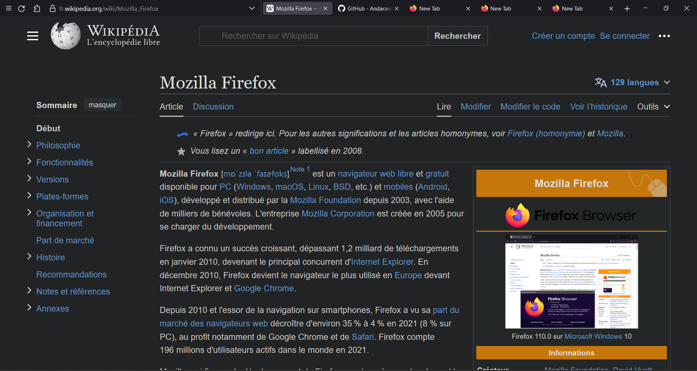

# One-line Firefox

## Get Started

### In Firefox

- Open _`about:config`_ and set:
  - `toolkit.legacyUserProfileCustomizations.stylesheets`: `true`
  - `browser.compactmode.show`: `true`
  - `extensions.pocket.enabled`: `false`
  - `browser.tabs.tabMinWidth` : `30`
  - `browser.urlbar.trimHttps` : `true`
- Go to Menu > More Tools > Customize Toolbar...: use compact density, auto-hide downloads button, remove all flexible space and unnecessary items.
- intall [tree style tabs](https://addons.mozilla.org/en-GB/firefox/addon/tree-style-tab/?utm_source=firefox-browser&utm_medium=firefox-browser&utm_content=discopane-entry-link)
- Open _`about:support`_, copy Profile Folder
- Add a blank space to the far left of the toolbar

### In terminal

```sh
cd $PROFILE_FOLDER # copied from the previous step
git clone https://github.com/Andarael/one-line-firefox chrome
```

Then restart Firefox.

If your bar doesn't show up in fullscreen when moving the cursor to the top edge of the screen, see [#2](https://github.com/khuedoan98/one-line-firefox/issues/2)

## Screenshots




## Acknowledgements

- https://github.com/khuedoan/one-line-firefox
- https://www.reddit.com/r/FirefoxCSS/comments/7eazix/my_attempt_at_a_oneline_interface/
- https://www.reddit.com/r/FirefoxCSS/comments/7ignsk/oneline_flat_interface_dark_light/
- https://github.com/andreasgrafen/ag.proton
